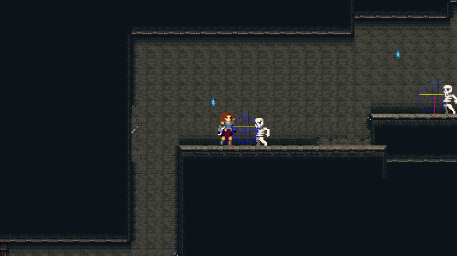
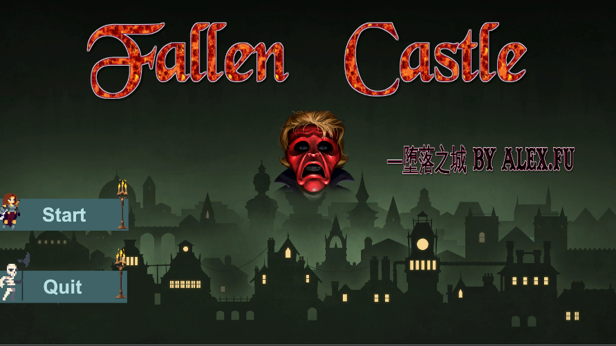
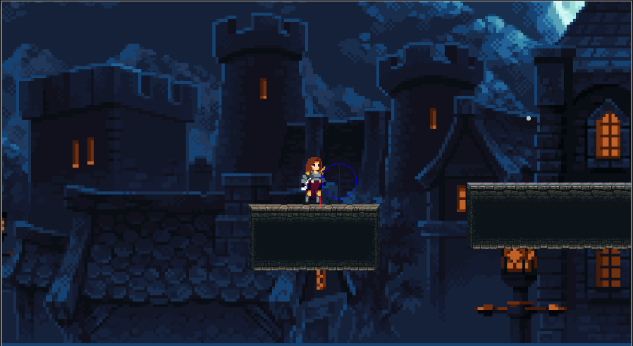

# 🏰 FallenCastle

**FallenCastle** 是一个基于 Unity 引擎开发的地下城动作游戏，融合了黑暗奇幻、美术风格与地下城。灵感来源于Unity教程。

---

## 🎮 游戏特点

- ✒️ 扔剑（战斗机制）
- 🧠 跳跃（事件成功率受角色影响）

---

## 🖼️ 项目截图


---

## 🛠️ 使用说明

### 克隆仓库：

```bash
git clone https://github.com/Szechuanese/FallenCastle.git
## 🖼️ 游戏截图集

### 📌 游戏主界面


### 🎭 事件与选项系统


### 🗺️ 
